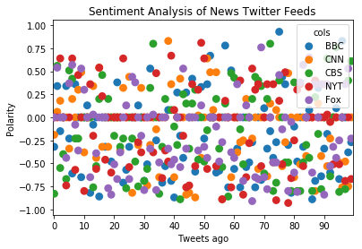
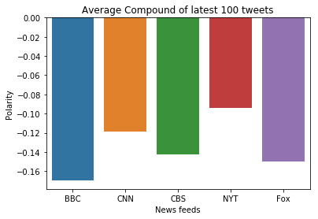

```python
import tweepy
import json
import numpy as np
import pandas as pd

# Import and Initialize Sentiment Analyzer
from vaderSentiment.vaderSentiment import SentimentIntensityAnalyzer
analyzer = SentimentIntensityAnalyzer()

import matplotlib.pyplot as plt
import matplotlib.ticker as ticker
import seaborn as sns
```


```python
from config import consumer_key, consumer_secret, access_token, access_token_secret

auth = tweepy.OAuthHandler(consumer_key, consumer_secret)
auth.set_access_token(access_token, access_token_secret)
api = tweepy.API(auth, parser=tweepy.parsers.JSONParser())
```


```python
target_sources=('@BBCWorld','@CNN','@CBSNews','@nytimes','@FoxNews')

df=pd.DataFrame(columns=['user','tweet text','compound','positive','negative','neutral','tweets back'])
df_final=pd.DataFrame(columns=['user','tweet text','compound','positive','negative','neutral','tweets back'])

for target_source in target_sources:
    
    source_list=[]
    tweet_list=[]
    compound_list=[]
    positive_list=[]
    negative_list=[]
    neutral_list=[]
    tweet_num_list=[]
   
    public_tweets = api.user_timeline(target_source, count=100)
    count=1
    
    for tweet in public_tweets:
        
        source_list.append(tweet['user']['screen_name'])
        tweet_list.append(tweet['text'])
        tweet_analysis = analyzer.polarity_scores(tweet['text'])
        compound_list.append(tweet_analysis['compound'])
        positive_list.append(tweet_analysis['pos'])
        negative_list.append(tweet_analysis['neg'])
        neutral_list.append(tweet_analysis['neu'])
        tweet_num_list.append(count)
        
        count+=1
    
    df['user']=source_list
    df['tweet text']=tweet_list
    df['compound']=compound_list
    df['positive']=positive_list
    df['negative']=negative_list
    df['neutral']=neutral_list
    df['tweets back']=tweet_num_list
    
    df_final=df_final.append(df)

df_final.to_csv('newsmood.csv')
```


```python
# Scatter plot
sns_df=pd.DataFrame(columns=['counter','BBC','CNN','CBS','NYT','Fox'])

for i in range(0,100):
    sns_df.loc[i]=[i,round(df_final.iloc[i][2],2),round(df_final.iloc[100+i][2],2),
                   round(df_final.iloc[200+i][2],2),round(df_final.iloc[300+i][2],2),
                   round(df_final.iloc[400+i][2],2)]

df=sns_df    
sns_df = sns_df.melt('counter', var_name='cols', value_name='vals')
g = sns.pointplot(x="counter", y="vals", hue='cols', data=sns_df,linestyles='')
g.set(xlabel='Tweets ago', ylabel='Polarity',title='Sentiment Analysis of News Twitter Feeds')

g.xaxis.set_major_locator(ticker.MultipleLocator(10))
g.xaxis.set_major_formatter(ticker.ScalarFormatter())

plt.show()
plt.savefig('scatter.png', dpi=400)
```





```python
# Bar plot

bar_df=pd.DataFrame(columns=['BBC','CNN','CBS','NYT','Fox'])
bar_df.loc[0]=[np.mean(df["BBC"]),
               np.mean(df["CNN"]),
               np.mean(df["CBS"]),
               np.mean(df["NYT"]),
               np.mean(df["Fox"])]

g=sns.barplot(data=bar_df)
g.set(xlabel='News feeds', ylabel='Polarity',title='Average Compound of latest 100 tweets')

plt.show()

plt.savefig('bars.png', dpi=400)
```




